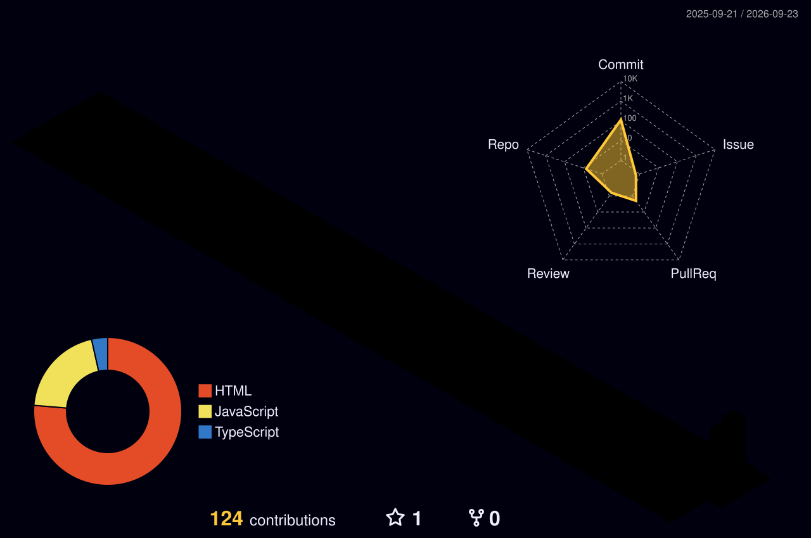

  <a href="https://github.com/roshanr14">
    <picture>
      <source media="(prefers-color-scheme: dark)" srcset="https://raw.githubusercontent.com/roshanr14/roshanr14/main/assets/roshan-warrior-duel.svg?v=2">
      <source media="(prefers-color-scheme: light)" srcset="https://raw.githubusercontent.com/roshanr14/roshanr14/main/assets/roshan-warrior-duel.svg?v=2">
      
    </picture>
  </a>

  

---

### 👨‍💻 **`PROFILE_DATA`**

| 🏷️ **ATTRIBUTE** | 💎 **SPECIFICATION & DETAILS** |
| :--- | :--- |
| 👤 **Name & Identity** | **`Roshan`** |
| 🎓 **Academic Degree** | **`Bachelor of Technology (B.Tech)`** — **`Engineering Undergraduate`** |
| 💼 **Core Domain** | **`Engineering Student`** & **`Full-Stack Web Developer`** |
| 💻 **Core Languages** |  **`Python`** • **`C++`** • **`JAVA`**|
| 🌐 **Frontend Stack** | **`React.js`** • **`Next.js`** • **`Tailwind CSS`** • **`Vite`** |
| ⚙️ **Backend & APIs** | **`Node.js`** • **`Supabase`** |
| 🗄️ **Databases** | **`MongoDB`** • **`PostgreSQL`** • **`MySQL`** |
| 🧰 **Tools** | **`Antigravity`** • **`GitHub`** • **`Vercel`** • **`Claude`** • **`VS Code`**  |
| 🎯 **Current Focus** | **`Eager to learn new technologies`** |
| ☕ **Fun Fact** | **`"I turn caffeine and curiosity into clean, functional code ☕🚀"`** |

---

#### 🏙️ **`3D_ISOMETRIC_CONTRIBUTION_CITY`**

  <a href="https://github.com/roshanr14">
    <picture>
      <source media="(prefers-color-scheme: dark)" srcset="profile-3d-contrib/profile-night-rainbow.svg">
      <source media="(prefers-color-scheme: light)" srcset="profile-3d-contrib/profile-night-rainbow.svg">
      
    </picture>
  </a>

#### 🐍 **`CYBERPUNK_CONTRIBUTION_SNAKE_GRID`**

  <a href="https://github.com/roshanr14">
    <picture>
      <source media="(prefers-color-scheme: dark)" srcset="https://raw.githubusercontent.com/roshanr14/roshanr14/output/github-contribution-grid-snake-dark.svg">
      <source media="(prefers-color-scheme: light)" srcset="https://raw.githubusercontent.com/roshanr14/roshanr14/output/github-contribution-grid-snake.svg">
      
    </picture>
  </a>

#### 🟩 **`365-DAY_CONTRIBUTION_CALENDAR_HEATMAP`**

  

---

### 📡 Transmit & Connect

  
  
  
  

---

   
  <i>💡 "Engineering is the art of turning mathematical logic into impactful reality."</i> 
  <b>⚡ Crafted with ❤️ by Roshan ⚡</b>

