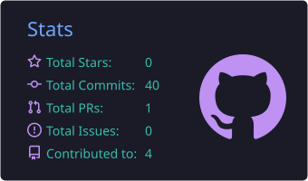
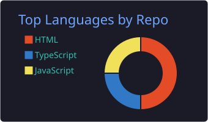
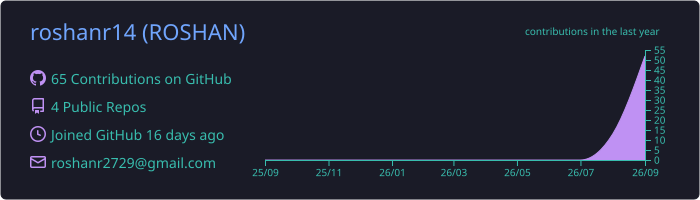
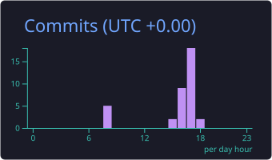

  

  

  
  &nbsp;
  

| 🚀 **PROJECTS** | 🤝 **HAPPY CLIENTS** | ⚡ **EXPERIENCE** |
| :---: | :---: | :---: |
|  <b>Completed Missions</b> |  <b>Global Collaborations</b> |  <b>Coding Experience</b> |

---

### 👨‍💻 **`PROFILE_DATA`**

| 🏷️ **ATTRIBUTE** | 💎 **SPECIFICATION & DETAILS** |
| :--- | :--- |
| 👤 **Name & Identity** | **`Roshan`** |
| 🎓 **Academic Degree** | **`Bachelor of Technology (B.Tech)`** — **`Engineering Undergraduate`** |
| 💼 **Core Domain** | **`Engineering Student`** & **`Full-Stack Web Developer`** |
| 💻 **Core Languages** | **`JavaScript (ES6+)`** • **`TypeScript`** • **`Python`** • **`C++`** • **`HTML5`** • **`CSS3`** |
| 🌐 **Frontend Stack** | **`React.js`** • **`Next.js`** • **`Tailwind CSS`** • **`Bootstrap`** |
| ⚙️ **Backend & APIs** | **`Node.js`** • **`Express.js`** • **`RESTful APIs`** |
| 🗄️ **Databases** | **`MongoDB`** • **`PostgreSQL`** • **`MySQL`** |
| 🧰 **Engineering Tools** | **`Git`** • **`GitHub`** • **`Docker Basics`** • **`Linux / Bash`** • **`VS Code`** • **`Postman`** |
| 🎯 **Current Focus** | **`Eager to learn new technologies & master DSA`** |
| ☕ **Fun Fact** | **`"I turn caffeine and curiosity into clean, functional code ☕🚀"`** |

---

### 🛠️ Technical Matrix & Arsenal

#### 🌐 Frontend Engineering

#### ⚙️ Backend & Databases

#### 🧰 Engineering Tools & DevOps

---

 

#### 🏙️ **`3D_ISOMETRIC_CONTRIBUTION_CITY`**

  <a href="https://github.com/roshanr14">
    <picture>
      <source media="(prefers-color-scheme: dark)" srcset="profile-3d-contrib/profile-night-rainbow.svg">
      <source media="(prefers-color-scheme: light)" srcset="profile-3d-contrib/profile-night-rainbow.svg">
      
    </picture>
  </a>

#### 🐍 **`CYBERPUNK_CONTRIBUTION_SNAKE_GRID`**

  <a href="https://github.com/roshanr14">
    <picture>
      <source media="(prefers-color-scheme: dark)" srcset="https://raw.githubusercontent.com/roshanr14/roshanr14/output/github-contribution-grid-snake-dark.svg">
      <source media="(prefers-color-scheme: light)" srcset="https://raw.githubusercontent.com/roshanr14/roshanr14/output/github-contribution-grid-snake.svg">
      
    </picture>
  </a>

#### 🟩 **`365-DAY_CONTRIBUTION_CALENDAR_HEATMAP`**

  

#### ⚡ **`ANALYTICS_ARSENAL & REPOSITORY_METRICS`**

  
  

  
  

  

---

### 🚀 Featured Missions & Projects

| Project Name | Description | Tech Stack |
| :--- | :--- | :--- |
| **[CyberDeck](https://github.com/roshanr14)** | All-in-one developer productivity workspace & dashboard | `React` `Node.js` `MongoDB` `WebSockets` |
| **[NexusFlow](https://github.com/roshanr14)** | Node-based visual AI workflow & prompt orchestration tool | `TypeScript` `Next.js` `Tailwind` `OpenAI` |
| **[HyperGrid UI](https://github.com/roshanr14)** | Accessible cyberpunk theme component toolkit | `Vanilla JS` `CSS3` `Web Components` |
| **[AlgoVisualizer](https://github.com/roshanr14)** | Step-by-step interactive Data Structures & Algorithm engine | `JavaScript` `HTML5 Canvas` `DSA` |

---

### 📡 Transmit & Connect

  
  
  
  

---

   
  <i>💡 "Engineering is the art of turning mathematical logic into impactful reality."</i> 
  <b>⚡ Crafted with ❤️ by Roshan ⚡</b>

